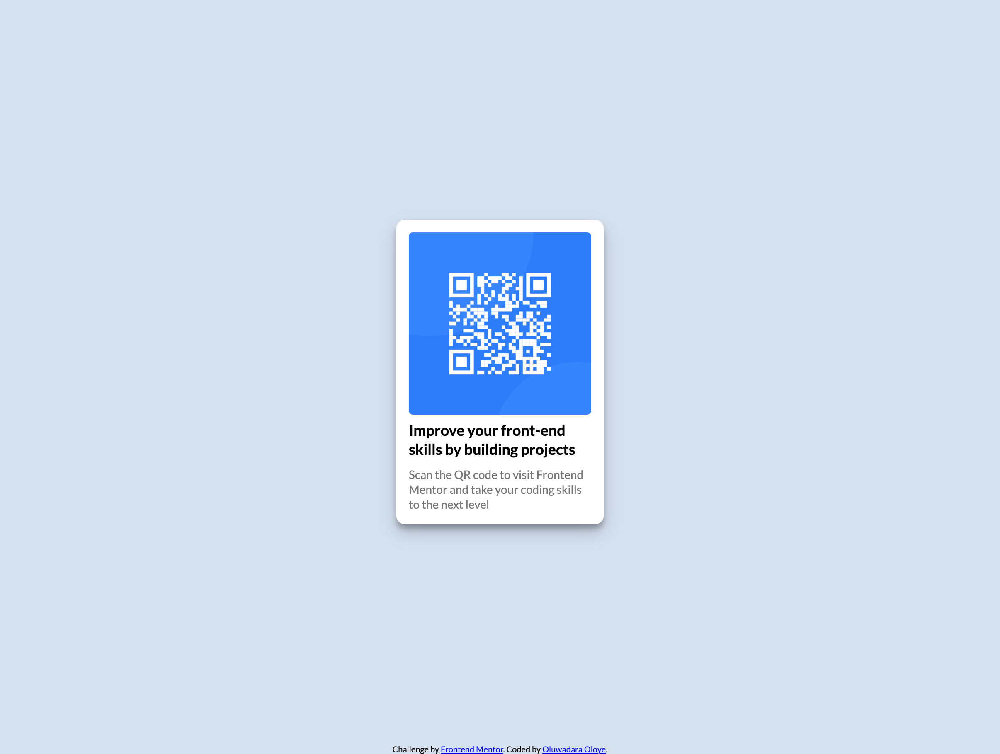

# Frontend Mentor - QR code component solution

This is a solution to the [QR code component challenge on Frontend Mentor](https://www.frontendmentor.io/challenges/qr-code-component-iux_sIO_H). Frontend Mentor challenges help you improve your coding skills by building realistic projects. 

## Table of contents

- [Overview](#overview)
  - [Screenshot](#screenshot)
  - [Links](#links)
- [My process](#my-process)
  - [Built with](#built-with)
  - [What I learned](#what-i-learned)
- [Author](#author)
- [Acknowledgments](#acknowledgments)

**Note: Delete this note and update the table of contents based on what sections you keep.**

## Overview
This is a project to display a responsive QR code image with a title and description that links to Frontend Mentor page
### Screenshot

### Links

- Solution URL: [GitHub Repository](https://github.com/OluwadaraDaily/qr-code-component)
- Live Site URL: [Live Site](https://qr-component-app.netlify.app/)

## My process

### Built with

- Semantic HTML5 markup
- CSS custom properties
- Flexbox
- Mobile-first workflow

### What I learned

Use this section to recap over some of your major learnings while working through this project. Writing these out and providing code samples of areas you want to highlight is a great way to reinforce your own knowledge.

To see how you can add code snippets, see below:

## Author

- Website - [Oluwadara Oloye](https://github.com/OluwadaraDaily)
- Frontend Mentor - [@OluwadaraDaily](https://www.frontendmentor.io/profile/OluwadaraDaily)
- Twitter - [@OluwadaraDaily](https://www.twitter.com/OluwadaraDaily)

## Acknowledgments

I got some help from [Melvin Aguilar](https://www.frontendmentor.io/profile/MelvinAguilar) on Frontend Mentor with some accessibility issues.

**Note: Delete this note and edit this section's content as necessary. If you completed this challenge by yourself, feel free to delete this section entirely.**
